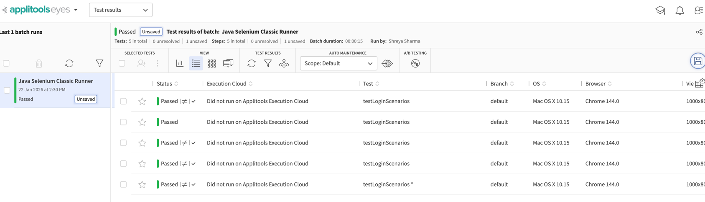

## Selenium + TestNG + Applitools (Classic Runner)

This project demonstrates UI test automation using Selenium WebDriver, TestNG, and Applitools Eyes (Classic Runner) in Java.

The focus is on:
- Functional UI automation with Selenium
- Test orchestration with TestNG
- Visual validation using Applitools Classic (no Ultrafast Grid)

Execute the code : mvn test

TestNG/
├── .mvn/
├── src/
│   ├── main/
│   │   ├── java/
│   │   │   └── pages/
│   │   │       └── applitoolsdemo/
│   │   │           ├── LoginPage.java
│   │   │           └── DashboardPage.java
│   │   └── resources/
│   │
│   └── test/
│       ├── java/
│       │   └── tests/
│       │       └── applitoolsdemo/
│       │           └── LoginClassicTest.java
│       └── resources/
│
├── pom.xml
├── README.md